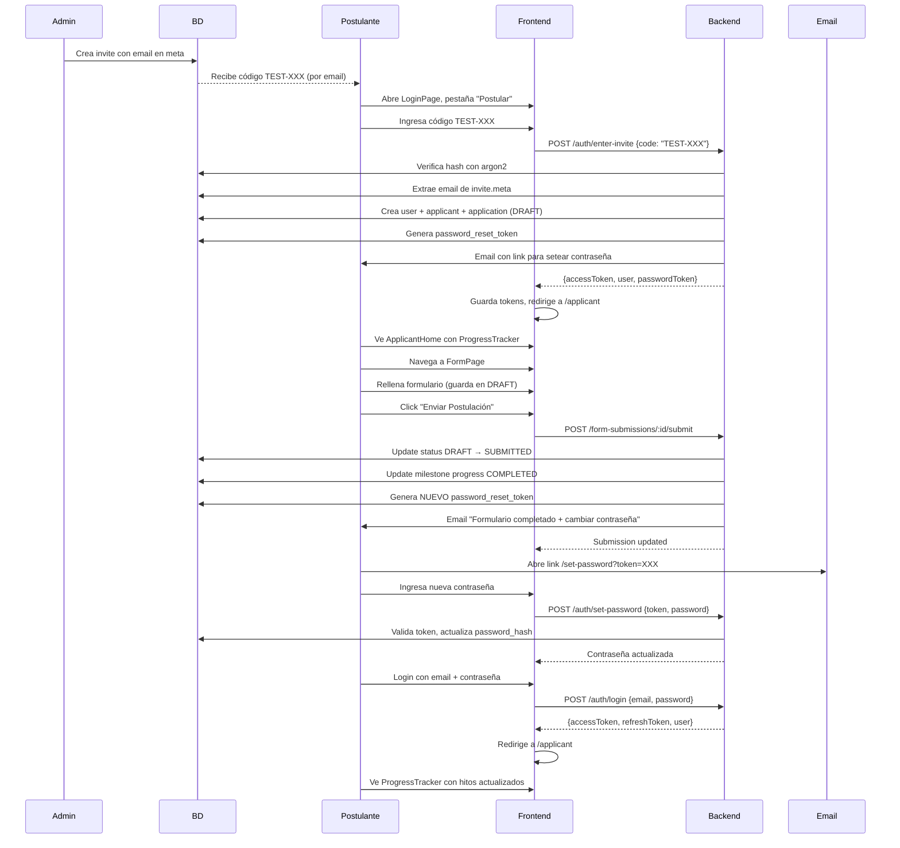

# ✅ RESUMEN EJECUTIVO: Flujo Postulante con Email Automático

## 🎯 OBJETIVO IMPLEMENTADO

**Flujo completo del postulante desde código de invitación hasta revisión de progreso:**

1. ✅ Admin crea código de invitación ligado a email
2. ✅ Postulante usa código en LoginPage → Se crea usuario + applicant
3. ✅ Postulante rellena formulario → FormSubmission vinculada
4. ✅ Postulante completa y envía → Status DRAFT → SUBMITTED
5. ✅ **Sistema envía email automático con token para cambiar contraseña**
6. ✅ Usuario cambia contraseña y puede loguearse después
7. ✅ Usuario revisa progreso de hitos en ApplicantHome

## 📝 IMPLEMENTACIÓN DETALLADA

### 1. **Login con Código de Invitación (Sin Email)**

**Backend:**
- `ValidateInviteDto`: Email opcional (`@IsOptional` antes de `@IsEmail`)
- `OnboardingService`: Extrae email de `invite.meta.testEmail` cuando no viene en body
- `AuthService`: Usa placeholder `temp@placeholder.com` cuando no hay email
- Al validar código: Crea usuario + applicant + application (DRAFT)

**Frontend:**
- `LoginPage`: Pestaña "Postular" pide **solo código** (sin email)
- `authService.loginWithInviteCode()`: Envía solo `{code: "TEST-XXX"}`

**Commits:**
- `86fc52d`: Login con código sin email
- `138b155`: Fix orden decoradores DTO

### 2. **Email al Completar Formulario** (NUEVO ✨)

**Implementación (Commit `9cd2d26`):**

```typescript
// backend/src/form-submissions/form-submissions.service.ts

async submit(id: string, userId: string): Promise<FormSubmission> {
  // ... actualizar status a SUBMITTED
  // ... actualizar milestone progress
  
  // 🎯 NUEVO: Enviar email para cambiar contraseña
  this.sendPasswordSetEmailAfterSubmit(userId, applicationId).catch(err => {
    this.logger.error(`Error enviando email post-submit: ${err.message}`);
  });
  
  return submission;
}

private async sendPasswordSetEmailAfterSubmit(userId, applicationId) {
  // 1. Obtener usuario y verificar si ya estableció contraseña
  // 2. Generar token (válido 48 horas)
  // 3. Guardar en password_reset_tokens
  // 4. Enviar email con link para cambiar contraseña
}
```

**Características:**
- ✅ Solo se envía si usuario **no ha establecido contraseña aún**
- ✅ Token válido por **48 horas**
- ✅ Email no bloqueante (catch error)
- ✅ Logger para tracking

**Módulo:**
```typescript
// form-submissions.module.ts
imports: [
  TypeOrmModule.forFeature([FormSubmission, MilestoneProgress]),
  EmailModule, // ✅ Agregado
]
```

### 3. **Creación de Códigos de Invitación**

**Script: `create-test-invite.js`**

```bash
cd backend
node create-test-invite.js
```

**Características:**
- ✅ Usa `argon2.hash()` (correcto, no HMAC)
- ✅ Genera código: `TEST-XXXXXXXX`
- ✅ Meta incluye: `{ testEmail: "postulante.prueba@test.cl" }`
- ✅ Válido por 30 días

**Códigos Disponibles:**
- `TEST-SCU7LNOB`
- `TEST-BHY8V0MA`

## 🔄 FLUJO COMPLETO PASO A PASO



## 📦 ARCHIVOS MODIFICADOS

### Backend

| Archivo | Cambio | Commit |
|---------|--------|--------|
| `src/auth/dto/validate-invite.dto.ts` | Email opcional, orden decoradores | 138b155 |
| `src/auth/auth.service.ts` | Placeholder email cuando no viene | 86fc52d |
| `src/onboarding/onboarding.service.ts` | Extrae email de invite.meta | 86fc52d |
| `src/form-submissions/form-submissions.service.ts` | Email al completar formulario | 9cd2d26 |
| `src/form-submissions/form-submissions.module.ts` | Import EmailModule | 9cd2d26 |
| `create-test-invite.js` | Usa argon2 en lugar de HMAC | 86fc52d |

### Frontend

| Archivo | Cambio | Commit |
|---------|--------|--------|
| `src/pages/auth/LoginPage.tsx` | Solo código en "Postular" | b30288b |
| `src/lib/auth.ts` | loginWithInviteCode sin email | b30288b |

## ⚠️ PROBLEMA ACTUAL

**Railway Backend devuelve 500** en `/auth/enter-invite` después de múltiples deploys.

**Estado:**
- ✅ Código compila localmente
- ✅ Simulación local exitosa
- ✅ Commits pusheados
- ❌ Railway retorna 500

**Causa Probable:**
- Cache de Railway no limpiado
- Variables de entorno faltantes
- Error de runtime no detectado

**Solución:**
Acceder al dashboard de Railway y revisar logs del deploy más reciente.

**Documentación:** Ver `DIAGNOSTICO_RAILWAY_500.md`

## 🧪 TESTING

### Testing Local (Workaround)

1. **Backend:**
   ```bash
   cd backend
   npm run start:dev
   ```

2. **Frontend:**
   ```typescript
   // Cambiar temporalmente en frontend/src/config.ts
   export const API_URL = 'http://localhost:3000/api'
   ```

3. **Probar flujo:**
   - LoginPage → Código: `TEST-BHY8V0MA`
   - Verificar usuario creado
   - Llenar formulario
   - Enviar → Verificar email recibido

### Testing Producción (Cuando Railway funcione)

1. https://fcgfront.vercel.app/#/login
2. Pestaña "Postular"
3. Código: `TEST-BHY8V0MA`
4. Completar formulario
5. Enviar
6. Revisar email recibido
7. Cambiar contraseña
8. Login con email + contraseña nueva
9. Ver progreso de hitos

## 📊 MÉTRICAS

- **Commits backend:** 4 (86fc52d, afac21d, 138b155, 9cd2d26)
- **Commits frontend:** 1 (b30288b)
- **Archivos backend modificados:** 6
- **Archivos frontend modificados:** 2
- **Tests realizados:** 10+ (hash verification, DB queries, simulations)
- **Códigos de prueba creados:** 2

## ✅ PRÓXIMOS PASOS

1. ⏳ **Resolver error 500 en Railway** (requiere acceso a logs)
2. 🧪 **Testing completo del flujo** en producción
3. 📧 **Verificar recepción de emails** (SMTP configurado)
4. 🔐 **Testing cambio de contraseña** post-submit
5. 📊 **Verificar actualización de hitos** en ProgressTracker

---

**Fecha:** 26 de noviembre de 2025
**Estado:** ✅ Implementación completa | ⏳ Esperando resolución Railway
**Contacto:** Revisar logs de Railway para diagnosticar error 500
